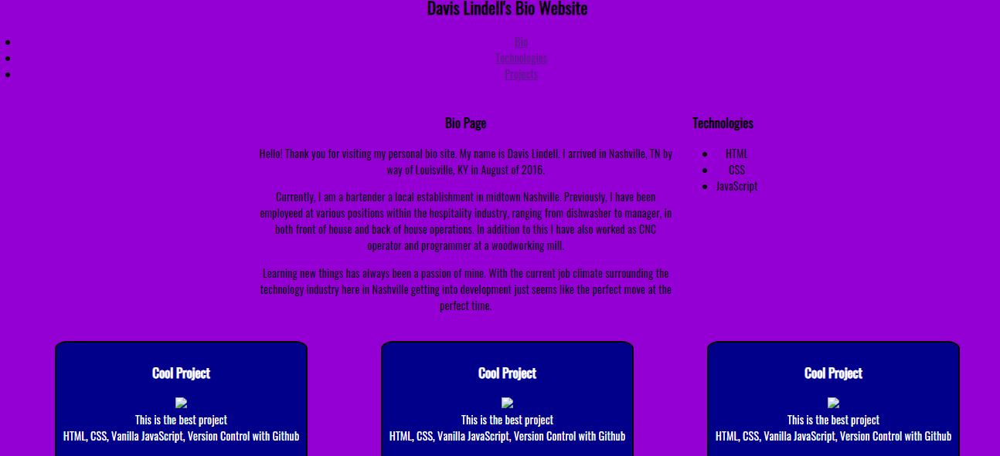

# Personal Bio Site

## Description
This project will eventually display all of the projects I have completed at my time at NSS. Slowly it will grow into something awesome the more I learn in my time here.

## Screenshot

## How to run
1. Clone down this repo

1. Make sure you have http-server installed via npm. If not get it HERE.

1. In your command line run `hs -p 9999`

1. In your browser go to to `http://localhost:9999`
